<div align="center">
  <h1>NexusQA 🤖 Autonomous Quality Intelligence Engine</h1>
  <p><strong>Shifting enterprise Software Testing away from "Blind Execution" to "Intelligent Exploration"</strong></p>

  [](https://opensource.org/licenses/MIT)
  [](https://www.python.org/downloads/)
  [](https://fastapi.tiangolo.com)
  [](https://react.dev/)
  [](https://neo4j.com/)
  [](https://playwright.dev/)
</div>

---

## 🌟 The Vision & The Problem We Solve

Modern enterprise software testing is crippled by fundamental industry flaws:

1. **The Maintenance Nightmare (Brittle Scripts):** Traditional tools like Selenium and Cypress force QA teams to write exact, rigid scripts telling the computer exactly what to click. When a developer changes a single button ID, the entire test suite breaks. Engineers spend up to 60% of their time fixing old tests instead of finding new bugs.
2. **Execution vs. Reasoning:** Current tools are "blind engines"—they only do exactly what they're told. They run a script and report Pass/Fail. They cannot explore unknown features, cannot correlate frontend UI glitches with backend API network errors, and cannot reason about business impact.
3. **Tool Fragmentation:** Enterprises use separate tools for UI testing, API testing, and Security scanning, lacking a unified "intelligence layer."

**Enter NexusQA.**

NexusQA abandons traditional scripting entirely. Give it a URL, and our system autonomously maps the application into a Neo4j knowledge graph, intercepts network telemetry to find hidden vulnerabilities, scores business risk, and writes the Playwright debugging script for the developer automatically. We act as an AI-driven quality inspector that continuously explores, analyzes, and evaluates applications independently.

---

## 🏗️ Architecture: The Tri-Agent DevSecOps Engine

NexusQA is powered by a multi-agent orchestrated architecture that communicates through a Neo4j Graph Database:

### 🗺️ Agent 1: The Cartographer (Map the Unknown)
- Operates autonomously to navigate the target web application like a human tester.
- Handles SPAs, complex interactivity, authentication, and multi-step forms.
- Employs **Heuristic Fuzzing** to type into search bars and trigger hidden Javascript layers.
- Uses **Structural Fingerprinting** to recognize page layouts and build a massive "Semantic Digital Twin" (a mapped graph) of the application inside Neo4j.

### 🕵️‍♂️ Agent 2: The Inspector (Contextual Discovery)
- Operates as a **Light Gray-Box Engine**, monitoring DOM structure, intercepting hidden network API payloads, and catching Javascript console errors.
- Scans for accessibility flaws (e.g., missing ARIA labels), security vulnerabilities, and logic defects.
- Evaluates the context of bugs (e.g., a missing ARIA label on a blog is "Low", but on a Checkout page, it escalates to "High").

### 👔 Agent 3: The Strategist (Executive Reporting & Auto-Healing)
- Aggregates the intelligence mapped in the Neo4j Graph into an **Executive Hygiene Score (0-100)** for C-Level leadership.
- Generates reproducible risk profiles.
- **The Healer:** Autonomously reads the database graph and writes a definitive, deterministic Python Playwright script that reproduces the exact vulnerability, saving engineering teams hours of manual debugging.

---

## 🔀 Codeflow & System Interactions

```mermaid
sequenceDiagram
    participant User
    participant Frontend as React + Vite Dashboard
    participant API as FastAPI Server
    participant Carto as Agent 1 (Cartographer)
    participant Insp as Agent 2 (Inspector)
    participant Strat as Agent 3 (Strategist)
    participant Graph as Neo4j Graph Database
    
    User->>Frontend: Submit target URL
    Frontend->>API: HTTP POST /api/agent/start
    
    rect rgb(20, 40, 60)
    Note over API, Graph: Phase 1: Exploration
    API->>Carto: Trigger Automated Crawl
    Carto->>Graph: Map Navigation States, Nodes & Routes
    Carto-->>Frontend: WebSocket: Live Frame Steaming & Logs
    end

    rect rgb(60, 40, 20)
    Note over API, Graph: Phase 2: Vulnerability Analysis
    User->>Frontend: Request Deep Analysis
    Frontend->>API: HTTP POST /api/agent2/start
    API->>Insp: Trigger Security & DOM Scan
    Insp->>Graph: Fetch App Architecture Map
    Insp-->>Insp: Light Gray-box network & state analysis
    Insp->>Graph: Link Issues (Type/Loc/Severity) to Page Nodes
    Insp-->>Frontend: WebSocket: Live Defect Stream
    end

    rect rgb(20, 60, 40)
    Note over API, Graph: Phase 3: Reporting & Healing
    User->>Frontend: Request Risk Report
    Frontend->>API: HTTP POST /api/agent3/start
    API->>Strat: Execute Heuristic Aggregation 
    Strat->>Graph: Query issue distribution & edge counts
    Strat-->>Strat: Generate Auto-Healing Playwright Scripts
    Strat-->>Frontend: Return Hygiene Score & Playwright Code
    end
```



---

## 💻 Tech Stack & Engineering Justifications

Our system is engineered for maximum performance, real-time feedback, and dynamic scalability.

- **Frontend (React 19 + Vite + Tailwind CSS + Lucide):** 
  Chosen to build an enterprise-grade SaaS dashboard with a dynamic UI layout. Vite provides a blazing fast development build step, while React 19 handles the complex state logic necessary for real-time visual streaming and WebSocket log management.
- **Backend Infrastructure (FastAPI + Python + AsyncIO):** 
  Selected for its native WebSockets support and asynchronous processing. Since AI task orchestration and browser interactions (Playwright) are highly I/O bound, `asyncio` and FastAPIs concurrency guarantees keep our connection manager streaming video and log frames seamlessly without blocking CPU threads. We implemented dedicated ProactorEventLoops to manage sub-process integrity on Windows.
- **Graph Knowledge Base (Neo4j):** 
  Relational (SQL) and Document (NoSQL) databases are not designed to natively represent interconnected paths. Web applications are fundamentally state-machines. Neo4j allows us to natively query complex navigational sequences (e.g., "Find all paths from `Dashboard` to `Settings` that triggered `CRITICAL` issues") efficiently.
- **Browser Automation Core (Playwright):** 
  Used over Selenium for its robust DevTools protocol implementation. Playwright allows deep inspection into active network requests, the DOM lifecycle, and websocket frames within the browser, allowing us to build an accurate light gray-box analytical engine.

---

## 🛡️ Comprehensive Test Cases (TC) Discovered Autonomously

Unlike rigid scripted QA, NexusQA's semantic mapping independently discovers defects across multiple vectors:

1. **State Transients & Broken Flows:**
   - Identification of infinite loops within wizard-styled forms.
   - Validation failures terminating complete user journeys.
2. **Network Payload Anomalies:**
   - Failing background APIs causing silent frontend faults.
   - Malformed data responses mapped natively to DOM rendering glitches.
3. **UI/UX Consistency & Hygiene:**
   - Overlapping elements, non-responsive viewport breakdowns, and unhandled Javascript Console errors.
4. **Security & Accessibility Scanning:**
   - Missing ARIA boundaries (`role`, `tabindex`, `aria-label`).
   - Unauthorized path accessibility across the app topology.
   - Unsanitized inputs triggering frontend structural breakdowns.

---

## 🚀 Getting Started

To spin up the local development suite and explore an application autonomously:

1. **Start the Required Database:**
   ```bash
   docker-compose up -d
   ```
   *(Ensure Neo4j is running the graph instance)*

2. **Boot the Backend API (FastAPI):**
   ```bash
   cd src
   pip install -r ../requirements.txt
   uvicorn api.server:app --reload --port 8000
   ```

3. **Launch the Intelligence Dashboard (React):**
   ```bash
   cd frontend
   npm install
   npm run dev
   ```

4. **Initialize Exploration:**
   Open the Dashboard, put in any target URL, and watch NexusQA map, inspect, and self-heal the app.

---
<div align="center">
    <i>NexusQA - Autonomous Software Exploration. Driven by Graph Intelligence.</i>
</div>
